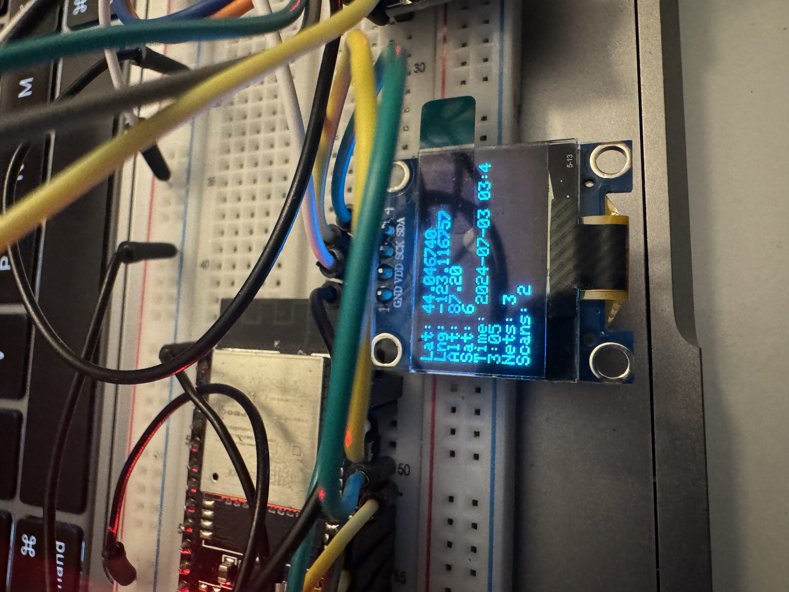
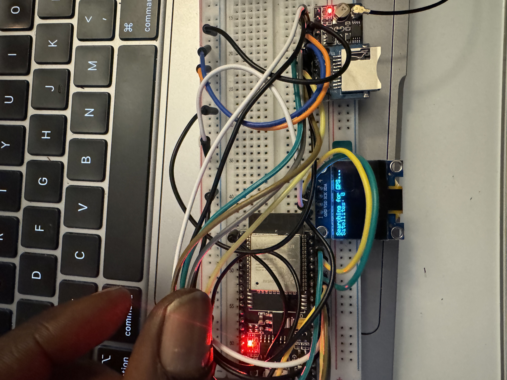
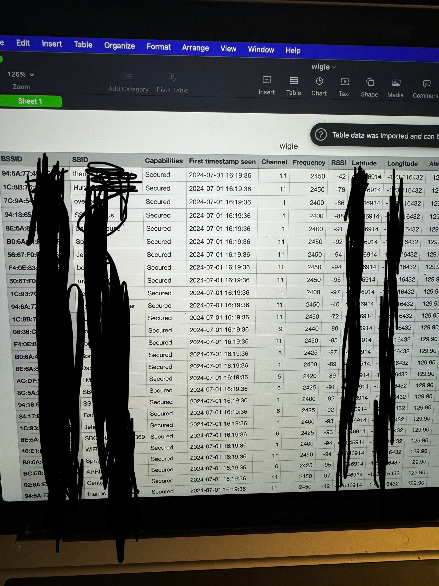

# esp32-gps-wifi-wigle
A DIY wardriver using ESP32 for GPS + WiFi data

# GPS and WiFi Network Scanner

## Description

This project is a comprehensive GPS and WiFi network scanning system using an ESP32 microcontroller, a GPS module, an OLED display, and an SD card. The system is designed to log GPS data and nearby WiFi networks for easy uploading to Wigle.net, making it ideal for wardriving, geolocation studies, and wireless network analysis.

## Features

- **GPS Integration**: Retrieves and displays latitude, longitude, altitude, and satellite count.
- **Real-Time Clock (RTC)**: Synchronizes with GPS time for accurate timestamping.
- **WiFi Scanning**: Scans for nearby WiFi networks, capturing SSID, BSSID, channel, RSSI, and encryption type.
- **Data Logging**: Stores GPS and WiFi data in a CSV file on an SD card for post-analysis.
- **OLED Display**: Real-time display of GPS data, network count, and scan count.
- **Serial Output**: Prints scan results and status messages to the serial monitor for debugging and real-time monitoring.

## Components

- **ESP32**: Microcontroller with integrated WiFi and Bluetooth.
- **GPS Module**: For acquiring GPS data (latitude, longitude, altitude, etc.).
- **OLED Display (128x64)**: For displaying real-time GPS and WiFi data.
- **SD Card Module**: For logging data in CSV format.
- **RTC Module**: Keeps accurate time using GPS synchronization.

 

## How It Works

1. **Initialization**: Sets up serial communication, initializes the GPS module, OLED display, SD card, and RTC.
2. **GPS Data Handling**: Continuously reads GPS data and updates the RTC.
3. **WiFi Scanning**: Periodically scans for WiFi networks, logs the data, and updates the display.
4. **Data Display**: Shows GPS data, number of networks found, and scan count on the OLED display.
5. **Data Logging**: Saves detailed information about each WiFi network and GPS position to a CSV file on the SD card.

## Usage

1. **Setup**: Connect the components as per the wiring diagram and upload the code to the ESP32.
2. **Operation**: Power on the device. The system will display GPS data on the OLED screen and log WiFi networks every 15 seconds.
3. **Data Retrieval**: Access the logged data by removing the SD card and opening the CSV file on a computer.

## Applications

- **Wardriving**: Collect and analyze data on available WiFi networks while moving through different locations.
- **Geolocation Studies**: Study the relationship between geographic locations and WiFi network distribution.
- **Wireless Network Analysis**: Evaluate network presence, signal strength, and security protocols in various areas.

## Contribution

I welcome contributions from the community! Feel free to fork the repository, submit issues, and create pull requests to improve the functionality and performance of this project.
