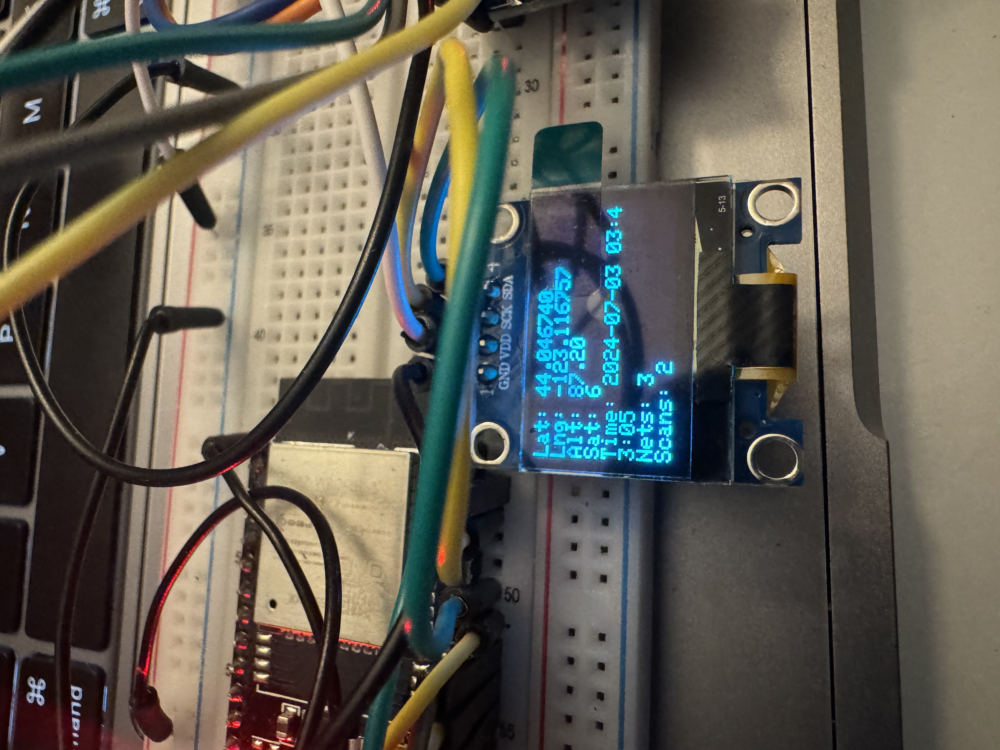
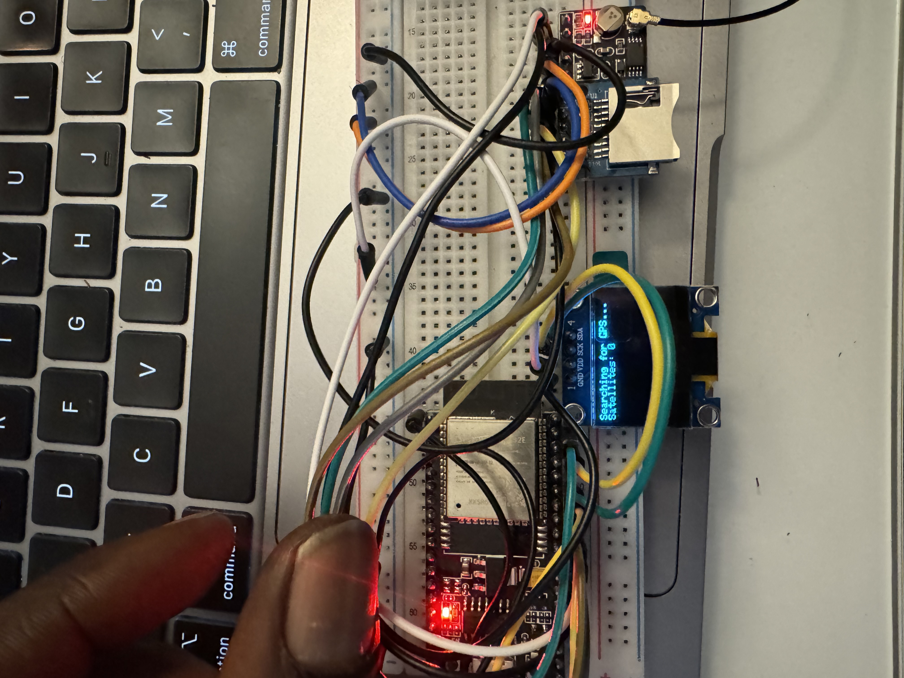

# ESP32 Wardriver Pro

A passive ESP32 GPS + WiFi wardriving logger that writes WiGLE-compatible CSV files to an SD card while showing live field status on a 128x64 OLED.

This project is for passive network discovery and location logging only. It does not deauthenticate clients, join networks, inject packets, or perform active attacks.


<br/>


## What It Can Do

| Area | Feature |
| --- | --- |
| WiFi logging | Passive station-mode scans with SSID, BSSID, auth mode, channel, frequency, RSSI, GPS position, altitude, and HDOP |
| WiGLE export | Writes `WigleWifi-1.4` CSV files named like `/wigle_YYYYMMDD_HHMMSS.csv` |
| GPS reliability | Waits for a fresh GPS fix before logging rows and continuously parses GPS between scans |
| OLED UI | Rotating dashboard pages for GPS, session stats, top access points, and storage health |
| Storage | SD session logs, periodic summary file, write-error tracking, and automatic rotation by size |
| Serial shell | `help`, `status`, `gps`, `scan`, `log on/off`, `fast on/off`, `ble on/off`, and `rotate` commands |
| Optional hardware | Button pins can be enabled in `src/Config.h` for page switching and logging pause/resume |
| Optional BLE | BLE scanner hook is present but disabled by default so the base WiFi logger stays small and stable |

## Hardware

- ESP32 DevKit-style board
- GPS module that outputs NMEA at 9600 baud
- 128x64 SSD1306 I2C OLED
- MicroSD card module
- FAT32-formatted microSD card
- Optional momentary buttons for field controls

## Default Wiring

| Module | ESP32 pin | Notes |
| --- | --- | --- |
| GPS TX | GPIO 16 | ESP32 RX for `Serial1` |
| GPS RX | GPIO 17 | ESP32 TX for `Serial1` |
| GPS VCC | 3.3V or 5V | Match your GPS module |
| GPS GND | GND | Common ground |
| OLED SDA | GPIO 21 | Default ESP32 I2C SDA |
| OLED SCL | GPIO 22 | Default ESP32 I2C SCL |
| OLED VCC | 3.3V | Most SSD1306 modules support 3.3V |
| OLED GND | GND | Common ground |
| SD CS | GPIO 5 | Configurable in `src/Config.h` |
| SD MOSI | GPIO 23 | Default ESP32 SPI MOSI |
| SD MISO | GPIO 19 | Default ESP32 SPI MISO |
| SD SCK | GPIO 18 | Default ESP32 SPI clock |
| SD VCC | 3.3V | Use level shifting if your module requires it |
| SD GND | GND | Common ground |

## Arduino CLI Setup

Install the ESP32 core and libraries:

```bash
arduino-cli core install esp32:esp32
arduino-cli lib install "TinyGPSPlus"
arduino-cli lib install "Adafruit SSD1306"
arduino-cli lib install "RTClib"
```

Compile:

```bash
arduino-cli compile --fqbn esp32:esp32:esp32 /Users/cypher/Documents/GitHub/esp32-gps-wifi-wigle
```

Upload after replacing the port with the current ESP32 port:

```bash
arduino-cli board list
arduino-cli upload --fqbn esp32:esp32:esp32 -p /dev/cu.usbserial-0001 /Users/cypher/Documents/GitHub/esp32-gps-wifi-wigle
```

Open the serial shell:

```bash
arduino-cli monitor -p /dev/cu.usbserial-0001 -c baudrate=115200
```

## Field Workflow

1. Format the SD card as FAT32 and insert it before boot.
2. Power the ESP32 outside or near a window until the OLED shows a fresh GPS fix.
3. The logger creates a session CSV after GPS time is available.
4. Walk or drive your route while the OLED rotates through GPS, stats, top APs, and storage pages.
5. Use the serial shell when connected to a laptop:

```text
help
status
gps
scan
fast on
log off
log on
rotate
```

6. Remove the SD card and upload the `wigle_*.csv` file to WiGLE.

Optional local validation after copying a CSV off the SD card:

```bash
python3 tools/validate_wigle_csv.py /path/to/wigle_YYYYMMDD_HHMMSS.csv
```

Example serial output:

```text
ESP32 Wardriver Pro
Commands: help, status, gps, scan, log on|off, fast on|off, ble on|off, rotate
Scan #4 found 18 networks
  AA:BB:CC:DD:EE:FF ch 6 -61 dBm CoffeeShopWiFi
```

Example CSV rows:

```csv
WigleWifi-1.4,appRelease=ESP32WardriverPro,model=ESP32,release=1.0,device=ESP32,display=SSD1306,board=esp32
MAC,SSID,AuthMode,FirstSeen,Channel,Frequency,RSSI,CurrentLatitude,CurrentLongitude,AltitudeMeters,AccuracyMeters,Type
"AA:BB:CC:DD:EE:FF","CoffeeShopWiFi","[WPA2-PSK-CCMP][ESS]","2026-05-01 19:12:44",6,2437,-61,37.774900,-122.419400,18.2,0.9,WIFI
```

## Configuration

Edit `src/Config.h` for field tuning:

- `GPS_RX_PIN`, `GPS_TX_PIN`, `GPS_BAUD`
- `SD_CS_PIN`
- `OLED_ADDRESS`
- `MIN_SATELLITES`
- `SCAN_INTERVAL_MS`
- `FAST_SCAN_INTERVAL_MS`
- `BUTTON_NEXT_PIN`, `BUTTON_SELECT_PIN`
- `ENABLE_BLE_SCANNER`

Buttons are disabled by default with `-1`. Set the button pins and wire each button from the GPIO to GND; the firmware uses `INPUT_PULLUP`.

BLE is intentionally disabled by default. If enabled later, keep BLE output in a separate file so the WiGLE WiFi CSV remains clean.

## Troubleshooting

| Problem | What to check |
| --- | --- |
| OLED says SD missing | Confirm FAT32 format, CS pin `5`, SPI wiring, and 3.3V power |
| No GPS fix | Move outside, check GPS TX to ESP32 GPIO 16, confirm 9600 baud, wait for satellites |
| CSV does not appear | Logging starts after a fresh GPS fix; use `gps` and `status` in serial monitor |
| Upload fails | Run `arduino-cli board list` again and use the current port |
| WiGLE rejects file | Confirm the first two CSV lines are present and the file was not edited by spreadsheet software |

## Project Layout

```text
esp32-gps-wifi-wigle/
|-- esp32-gps-wifi-wigle.ino   # Arduino entrypoint: setup/loop orchestration
|-- src/                       # Firmware modules compiled by Arduino CLI
|-- tools/                     # Local helper scripts
|-- wardriver1.jpg
|-- wardriver2.jpg
`-- README.md
```

Key firmware files:

- `src/Config.h` - pins, intervals, feature flags
- `src/GpsManager.*` - GPS parsing and GPS-backed clock
- `src/WifiScanner.*` - passive WiFi scan, unique BSSID tracking, top APs
- `src/StorageManager.*` - SD logs, WiGLE CSV, summary files
- `src/DisplayUi.*` - OLED dashboard pages
- `src/SerialShell.*` - field debug commands
- `src/BleScanner.*` - optional BLE extension hook
- `tools/validate_wigle_csv.py` - quick CSV sanity checker before WiGLE upload
